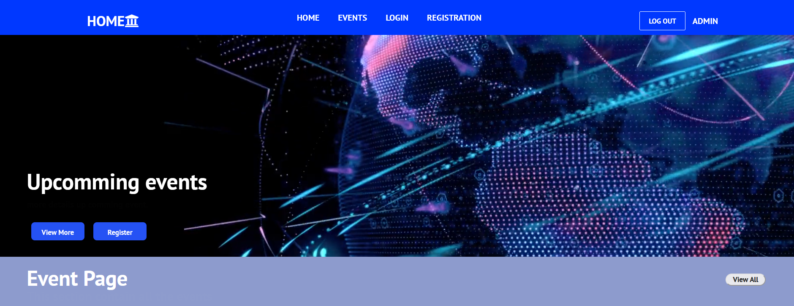

#
# AF Project Git Repos

Front end : <https://github.com/AnawaratneMANA/AF_GRP_PROJ_FR.git>

Back end : <https://github.com/AnawaratneMANA/AF_GRP_PROJ_BK.git>

# Overview

This is a research management system created for the Application framework final project. System developed in a generic way so that it can adapt by any organization to perform common tasks which are to be managed by an automation procedure. 

The system accepts multiple user types. This also can be increased programmatically to fits the right requirement of the organization or the company. Predefine users are such as Admin, Researchers, Editors, Guest users. Reviewers. 

The site provides out-of-the-box functionality which also can be changed later to match the users’ exact requirements. 

Users can attach files, add event details, Subscribe to a conference event. In this application user management process is securely implemented using two-way authentication using JWT Auth tokens to provide a much more robust authentication platform for the users. 

Users will easily be able to see event details and forth-coming event details making sure that they will not miss anything. 

Upon subscribing to events users can also make registration payments using the in-built payment platform in the system. This provides payment managers a rich dashboard to keep track of every payment and person who does the payment. 

This payment also comes with some ads once such as automated email procedures. That automatically triggers whenever there’s payment happens. This will provide a confirmation to the payment holder about the transactions done using the system.

The system also has a dashboard for admins to manage users and content that get uploaded. Content will be shown on the web page once the admin approves them. 

Front end UI of the system implemented using ReactJS and compatible with all the modern browsers, Backend of the system powered by a Java Spring Boot Application. 

## Site full view
## Landing page 

Navbar and Landing Page

1. Logo – Logo of the Website (When pressing this logo, we can navigate to the home page). 
1. Home – Navigation button to the home page.
1. Event - Navigation button to the Event page (If a visitor (unregistered user) pressed this button he/she navigate to the login page since to navigate to the event page visitor must register)
1. Login - Navigation button to the user login page.
1. Registration - Navigation button to the registration page.
1. Admin - Navigation button to the admin login page.
1. Logout - Navigation button to the user to logout.

1. View More - Button to navigate to Upcoming events of the system.
1. Register - Button to navigate to the registration page.

## User

### Login

Login section: this section shows the login function of the system to the user. When the user logging into the section system checks whether the user’s username and password are correct and if they are correct system checks the user types of users and navigate to the home section with relevant privileges with the relevant user type 

Name: Text field to enter the Name of the user  

Password -Text field to enter the Password of the user. 

Login Button - Button to login 

Registration - Button to navigate to the registration page. 

Forget Password - Link to navigate user if user forget password.  

### Registration

Register Section - This section used to register unregistered users to register to the system. 

Username: Text field to enter the Username of the user 

First Name: Text field to enter the First Name of the user  

Last Name: Text field to enter the Last Name of the user   

Email: Text field to enter the Email of the user     

Password -Text field to enter the Password of the user.

Re-Enter Password -Text field to enter the Re-Enter Password of the user 

Login Button - Button to login 

Registration - Button to navigate to the registration page. 

## Admin Pages

### Admin login

This shows the login for all Admins. 

Admins have a separate login that must be hidden from other users. To login as an Admin, admins have to use the “/adminlogin” endpoint to the URL. When the Admin logins to the system, the system checks whether the username and password are correct systems checks whether the user type is “Admin” and if all are correct Admin can navigate to the admin page.

1. Name: text field to enter the Admin Username 
1. Password: text field to enter the Admin Password
1. Login Button: Button to log in as an admin (If all the privileges are correct Admins can navigate to admin page)
1. Registration Button: Button to navigate to Registration page (After this button pressed using the endpoint)
1. Forgot Password Link for admin

URL to the Admin Login

https://application-framework-frontend.netlify.app/adminlogin

###
### Admin Dashboard

In Admin Management there are mainly 4 main tasks that need to be done. All those 4 tasks are done on the admin page and to navigate to the admin page Admin user needs to log in from relevant admin authentications.

This overview shows the graphic characteristics of Downloads and Events of the System 

1. Download Graph: This shows the variation of downloads with approved counts and rejected count.
1. Event Graph: This displays all the count of events of event management according to the year that those events published.

User Entry Form

1. First Name: Input field for the First Name of User Entry Form 
1. Last Name: Input field for the Last Name of User Entry Form 
1. Username: Input field for Username of User Entry Form 
1. Password: Input field for Password of User Entry Form 
1. Type: Dropdown for User Type of User Entry Form 
1. Submit Button

User Detail Table

1) User Details Table: Display details of the users in the System 
1) Delete Link: Link to delete the User.
1) Update Link: Link to Update User data 
1) The function of Update Link: When pressed that link all the data in that row go to the form.

This Overview shows the All the Files that in the System as a table in the admin interface.

1. Admin file Table: Table to display all file contents of the System. 
1. Download Button: Button to download the file (When pressing the download button user can download the relevant that user have uploaded)

This shows all the event details of the system as a table in admin interface.

Editor content table: Table to display all the editor contents of the system (All the events)

1. Approve Link: Link to Approve the event status of each event (When pressing the link, we update the database ‘status’ value to “approved”)

1. Reject Link: Link to Reject the event status of each event (When pressing the link, we update the database ‘status’ value to “declined”)

Monitoring Section: This section Shows the No of Users and No of files in the system

1) Total Files: No of files in the system ( This is the database value of total number of downloads in the system)
1) Total Users: No of users of the System  ( This is the database value of total number of users in the system)

## Downloads section

### Overview 
Some latest Download categories are shown on the home page's separate section. This can be viewed without any authentication. But in case if users want to upload files and or to view all the downloadable categories they must log in and create a session with the proper authentication.

### Technical Overview 
The File Upload process uses Firebase real-time databases to hold all the references of files that get uploaded to the storage pool. Therefore, browsing files can be done without any latency or users can upload files in any file size with the compatible file system. 

1.View all buttons - This button shows all download categories available on the site.

2.Download button - This button shows all download category inside the particular download category.

\3. Download Component - This component shows the category name with the category description. 

### ` `All Download Category Page

Using this search bar, users can search the categories by name.

This is a download category insertion from. This defines the downloadable categories on the website. For each category, users can upload files and download them. Supported files are limited to Images types (PNG, JPEG)  and PDF, DOCX.

1.Category Name - Input for the download category name

2.Description - Input for the download category description

3.SUBMIT button - can insert new download category for the system.

1.Inside all download category page bottom of the form display all download categories.

2.download button - user can see all the download items for the particular download category 

### Download Items page for particular download categories.

This Section shows the File uploading section related to the category it selected

1.Choose File - The user can select and upload the file

When click the Choose file button pop up window to upload the file.

1.Filename - Here display the file name added by the user

2.File type- display the file type

3.downlaod link - user can download the file

Rating Section Inside the home

In this section, some of the latest ratings of the user will be shown. Users can log in to the system and provide feedback on what they experience on the site.  

1.Name - The name of the user will be displayed here.

\2. Feedback - Feedback message

3.Rating - Rated value by the particular user. 

4.View All - The view all pages will show all the ratings done to the system.

### Search bar

Using this search bar, users can search the feed backs by the name.

### Feedback Form 

This form displays the inside all rating display page.

1) Rating – by hovering over the five star you can select a rating.
1) Name - Input of the name of user who providing the feedback.
1) Feedback - Input of the feedback.
1) Submit - can submit the feedback to the system.
### All Feedbacks in the system

1) Username - display the name of the user who adding the feedback
1) FeeBack - display the feedback
1) Rating - display the rating 

### Key Speakers Home section

In this section, some of the latest Key speakers will be shown.

1) View All - Login user can see all the key Speakers by navigating to all key speakers page

Users can search the key speakers by their names.

This Form displays inside the all the key speaker’s page.

Here can add new key speaker to the system.

1) Name - Input the name of the Key speaker.
1) Qualifications- input of the key speaker qualifications.
1) Choose file – to upload a profile photo.
1) Submit - can enter new key speaker.

Here display all the key speakers available in the system.

### Gallery Section inside the Home

Here display some latest event images.

Here user can click one gallery and see the zoom out image.

## Event 

### Event Home section

Here display some latest events in the home event section. This includes only a preview of the top four events in the system. To view all the details and subscribe to events or add new events users can log in to the site. 

Event Page - This shows the latest Events in the System that are displayed on the home page as a separate section. To see all the events in the system user has to register to the system. 

1.Event component - Show the event image with event name (When pressing this component registered users can navigate to the detailed page of the selected event)

2.View All - click that button valid user can navigate to see all events in the system

### Event entering form.

1. Event type Selector - This shows the main events type.
1. Event Name - This input for enter the event name.
1. Organizer name - This input for enter the organizer name.
1. Main Speaker Name - This input for enter the main speaker’s name.
1. Place or Link - This input for enter the event place or link.
1. Date - This picker is for selecting the event data.
1. Description - This input for enter the event description.
1. Sponsor - This input for enter the sponsor of the event.
1. Limit of people - This input for enter the limit of people.
1. Choose File - This button for enter the event image.
1. Send - This button is for add new event for the system.

### All Events 

Here display all the events available in the system.

Click by the one event component login user navigate another page for register for the selected event. 
### Single Event page

1.Event Name - display the selected event name

2.Event description - displays the selected event description

3.Image - display the image of the selected event

4.Details - display the event details

5.Enroll now - can register for the event

### Payment

This page shows the form to enter details to register for the event. When Registering for the event user must first pay the payment and take the user token

Payment Amount - this displays the amount that the user has to pay.

Event Name - This displays the event Name that user to enroll.

User Token - This displays the User Token after the user did the payment successfully)

Username - Text field to enter the username.

Phone Number- text field to enter the user Phone Number.

Pay with card - Button to navigate to the card payment section. 

Card payment Section - Section that entering the details that needed to do the card payment (When user did the card payment successfully user receive a mail to the entered email address, and this generate a user token and it displays on the payment page)

Email - Text field to enter email.

Card Number - text field to enter the card number. 

MM/ YY - Text field to enter the Month and Year.

CVC - Text field to enter the CVC number. 

Payment Button - Button to do the payment (After pressing this button user get a message that payment is done successfully) 

**Group Details**

|Student ID |Student Name|
| :- | :- |
|||
|IT19121048|Ekanayaka E.M.S.G.|
|IT19099514|Chandrasena T.K.T.A.|
|IT19086408|Anawaratne M.A.N.A.|
|IT19104690|Nandana G.M.D.|
|||

